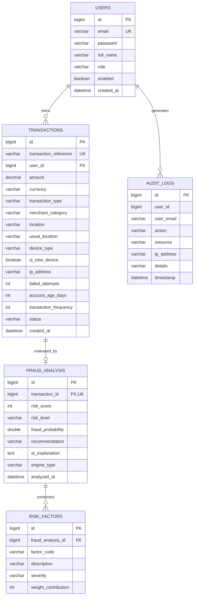

# FraudShield AI: AI-Powered Fraud Detection System

> **Tagline**: *Detect. Analyze. Protect.*  
> An enterprise-grade, modern full-stack financial transaction fraud detection and risk analytics platform built with **Java 17+**, **Spring Boot 3**, **Spring Security (JWT)**, **MySQL & JPA**, **Google Gemini AI**, and **Chart.js**.

---

## 📌 Table of Contents
1. [Project Overview](#-project-overview)
2. [Problem Statement & Objectives](#-problem-statement--objectives)
3. [Key Features](#-key-features)
4. [Technology Stack](#-technology-stack)
5. [System Architecture](#-system-architecture)
6. [Database Schema & Entity Design](#-database-schema--entity-design)
7. [Fraud Detection & Scoring Logic](#-fraud-detection--scoring-logic)
8. [AI Explanation Service](#-ai-explanation-service)
9. [Pluggable Machine Learning Architecture](#-pluggable-machine-learning-architecture)
10. [REST API Documentation](#-rest-api-documentation)
11. [Installation & Setup Guide](#-installation--setup-guide)
12. [Environment Variables](#-environment-variables)
13. [Default Demo Credentials](#-default-demo-credentials)
14. [How to Explain This Project in a Viva](#-how-to-explain-this-project-in-a-viva)
15. [CV / Resume Project Description](#-cv--resume-project-description)
16. [Future Enhancements](#-future-enhancements)

---

## 🚀 Project Overview

Financial fraud represents tens of billions of dollars in annual losses across e-commerce, banking, and payment gateways. Traditional static fraud detection systems rely on rigid rules that trigger high rates of false positives and fail to articulate *why* a transaction was blocked.

**FraudShield AI** solves this challenge by implementing an intelligent, multi-layered risk evaluation pipeline. It combines:
- **Real-Time Behavioral Telemetry**: Ingests transaction velocity, geo-velocity anomalies, device fingerprinting, and spending baselines.
- **Modular Multi-Factor Scoring Engine**: Calculates an objective 0–100 risk score and assigns a clear risk tier (`LOW`, `MEDIUM`, `HIGH`) and transaction disposition (`APPROVED`, `FLAGGED_FOR_REVIEW`, `BLOCKED`).
- **Generative AI Natural Language Explanations**: Converts complex multi-dimensional risk signals into human-readable security narratives using the **Google Gemini API** (with resilient local heuristic fallbacks).
- **Interactive Fintech Command Center**: A responsive dark-mode dashboard featuring Chart.js visual analytics, 1-click viva simulation presets, downloadable audit reports, and administrative surveillance.

---

## 🎯 Problem Statement & Objectives

### The Problem
- **Sophisticated Account Takeovers (ATO)**: Attackers bypass basic credentials using session hijacking and credential stuffing.
- **High False Positive Rates**: Blanket transaction limits disrupt legitimate users while missing low-value velocity fraud.
- **Lack of Interpretability ("Black Box" Problem)**: Security analysts and customers are left in the dark when transactions are declined without contextual explanations.

### Project Objectives
1. **Accurate Risk Scoring**: Score transactions on an objective scale of `0 to 100` within milliseconds.
2. **Behavioral Anomaly Detection**: Spot discrepancies between current activity and established account baselines.
3. **Transparent Explainability**: Provide immediate plain-English explanations of flagged anomalies for compliance and user trust.
4. **Clean Decoupled Architecture**: Separate transaction processing, risk scoring, and AI explanation into independent, modular layers ready for machine learning model plug-ins.

---

## ✨ Key Features

- **Role-Based Access Control (RBAC)**: Distinct permissions for standard financial users (`ROLE_USER`) and compliance officers (`ROLE_ADMIN`).
- **Stateless JWT Security**: HMAC-SHA256 bearer tokens with BCrypt password hashing.
- **1-Click Viva Demo Presets**: Instantly load **Safe** ($42.50), **Medium Risk** ($750.00), and **High Risk Fraud** ($4,850.00) scenarios for viva presentations and examiners.
- **Animated Risk Score Gauge**: Circular SVG gauge visually communicating threat severity with color transitions (Green $\le$ 30, Amber $\le$ 70, Red > 70).
- **Interactive Visual Analytics (Chart.js)**:
  - Donut chart: *Safe vs Fraudulent Transaction Volume*
  - Bar histogram: *Risk Level Distribution (Low / Medium / High)*
  - Line curve: *7-Day Fraud Risk Trajectory*
  - Mixed bar/line: *Transaction Amount vs Risk Score Correlation*
- **Executive PDF / Print Incident Reports**: One-click printable reports formatted for compliance and audit logs.
- **Dual-Mode Database**: Out-of-the-box zero-config embedded H2 fallback for instant demos, plus production-ready MySQL configurations.

---

## 🛠 Technology Stack

| Layer | Technologies |
|---|---|
| **Backend Core** | Java 17+, Spring Boot 3.3.4, Spring Web (RESTful APIs) |
| **Security & Auth** | Spring Security 6, JJWT (io.jsonwebtoken 0.12.5), BCrypt |
| **Data & Persistence** | Spring Data JPA, Hibernate ORM, MySQL 8.0+ Connector, H2 (embedded demo) |
| **AI & NLP** | Google Gemini API (gemini-1.5-flash / gemini-2.0-flash), Rule-based Heuristic Synthesizer |
| **Frontend UI** | Modern HTML5, Responsive Vanilla CSS (Fintech/Cybersecurity Design System), Vanilla JS |
| **Data Visualization** | Chart.js 4.4 |
| **Build Tooling** | Maven 3.9+ with standalone embedded wrapper (`mvnw`, `mvnw.cmd`) |

---

## 📁 Project Directory Structure

```
Ai project/
├── backend/                        # Java 17+ Spring Boot 3 Backend
│   ├── .tools/                     # Embedded Apache Maven
│   ├── mvnw & mvnw.cmd             # Maven Wrapper scripts
│   ├── pom.xml                     # Backend dependencies (Spring Boot, Security, JPA)
│   ├── src/
│   │   ├── main/java/com/fraudshield/
│   │   │   ├── config/             # SecurityConfig, JWTFilter, DataInitializer
│   │   │   ├── controller/         # Auth, Txn, Fraud, Admin, User REST APIs
│   │   │   ├── dto/                # Request & Response Data Transfer Objects
│   │   │   ├── entity/             # User, Transaction, FraudAnalysis, RiskFactor, AuditLog
│   │   │   ├── exception/          # Global exception handler & error models
│   │   │   ├── repository/         # Spring Data JPA Repositories
│   │   │   ├── service/            # Core business, scoring engines & AI explanation
│   │   │   └── util/               # JwtUtil (HMAC-SHA256)
│   │   └── resources/
│   │       ├── application.properties
│   │       ├── application-mysql.properties
│   │       ├── schema.sql & data.sql
│   │       └── static/             # Embedded fallback web assets
│   └── README.md                   # Backend documentation
│
├── frontend/                       # Modern Fintech & Cybersecurity UI Client
│   ├── index.html                  # Single-page container (Dashboard, Forms, Gauge)
│   ├── css/
│   │   └── styles.css              # Dark-mode fintech design system & glassmorphism
│   ├── js/
│   │   └── app.js                  # SPA routing, Chart.js integrations & API client
│   └── README.md                   # Frontend documentation
│
├── run-backend.bat / .ps1          # 1-Click launcher for Backend
├── run-frontend.bat / .ps1         # 1-Click launcher for Frontend
└── README.md                       # Full documentation & Viva Q&A Guide
```
        
        subgraph BusinessLayer [Business & Service Layer]
            AuthService[Auth & User Service]
            TxnService[Transaction Management Service]
            
            subgraph FraudModule [Modular Fraud Assessment]
                ScoringEngine[FraudScoringEngine Interface]
                RuleEngine[RuleBasedScoringEngine\nWeighted Multi-Factor Analysis]
                MLAdapter[MLScoringEngineAdapter\nFuture XGBoost / Random Forest]
                ScoringEngine --> RuleEngine
                ScoringEngine -.-> MLAdapter
            end
            
            subgraph AIModule [AI Explanation Layer]
                AiService[AiExplanationService Interface]
                GeminiService[GeminiExplanationService\nGoogle GenAI API]
                LocalAiFallback[RuleBasedExplanationService\nContextual Heuristic Engine]
                AiService --> GeminiService
                AiService --> LocalAiFallback
            end
            
            AuditService[Security Audit Logging Service]
        end
        
        JPA[Spring Data JPA Repositories]
    end
    
    MySQL[(MySQL 8.0 / Embedded H2)]
    GeminiAPI[(Google Gemini Cloud API)]

    Client -->|REST API + Bearer JWT| Security
    Security --> Controllers
    Controllers --> BusinessLayer
    TxnService --> FraudModule
    FraudModule --> AIModule
    BusinessLayer --> JPA
    JPA --> MySQL
    GeminiService -->|HTTPS + GEMINI_API_KEY| GeminiAPI
```

---

## 🗄 Database Schema & Entity Design

The database contains 5 normalized tables with foreign key constraints, cascade rules, and query performance indexes:



---

## ⚙️ Fraud Detection & Scoring Logic

The scoring engine evaluates **8 weighted risk vectors** against historical baseline behavior:

| Factor | Evaluation Criteria | Points Weight | Severity |
|---|---|---|---|
| **Amount Anomaly** | Extreme amount ($> \$10,000$) or $> 4\times$ account average | 24 – 30 pts | HIGH |
| **Location Mismatch** | Transaction city/country differs from user residence | 22 pts | HIGH |
| **Authentication Failures** | $\ge 3$ consecutive failed password/PIN attempts | 22 pts | HIGH |
| **Unrecognized Device** | New / unregistered browser or hardware signature | 20 pts | HIGH |
| **Velocity Burst** | High frequency spike ($\ge 5$ transactions in short window) | 18 pts | HIGH |
| **High-Risk Merchant** | Crypto exchange, casino, luxury jewelry | 16 pts | HIGH |
| **New Account Risk** | Account age $< 7$ days executing large transactions | 15 pts | HIGH |
| **Temporal Anomaly** | Initiated during late night hours (2:00 AM – 5:00 AM) | 7 pts | LOW |

### Risk Classification Thresholds
- **Score 0 – 30** $\rightarrow$ **LOW RISK** $\rightarrow$ Status: `APPROVED`  
  *Action*: Approved under normal operational parameters.
- **Score 31 – 70** $\rightarrow$ **MEDIUM RISK** $\rightarrow$ Status: `FLAGGED_FOR_REVIEW`  
  *Action*: Step-up authentication (SMS/Email OTP) required.
- **Score 71 – 100** $\rightarrow$ **HIGH RISK** $\rightarrow$ Status: `BLOCKED`  
  *Action*: Transaction halted; requires live customer identity verification.

---

## 🧠 AI Explanation Service

A common flaw in fraud detection systems is the lack of interpretability. FraudShield AI separates **scoring** from **explanation**:
1. The **Scoring Engine** evaluates attributes and outputs a deterministic score and list of triggered `RiskFactor` entities.
2. The **AI Explanation Service** translates these metrics into concise, professional natural language.

### Dual Engine Implementation
- **Primary (`GeminiExplanationService`)**: Connects to Google Gemini API (`gemini-1.5-flash`) with strict analytical instructions.
- **Resilient Fallback (`RuleBasedExplanationService`)**: If `GEMINI_API_KEY` is omitted or network connectivity drops, an intelligent heuristic engine synthesizes grammatically structured explanations without downtime.
- **Zero API Key Leakage**: Keys remain securely encapsulated in backend environment variables and are never transmitted to the browser.

---

## 🔮 Pluggable Machine Learning Architecture

The system is explicitly engineered to allow replacing the rule-based engine with a machine learning model without touching controllers or database entities.

### Integration Blueprint
1. Implement the `FraudScoringEngine` interface:
   ```java
   public interface FraudScoringEngine {
       FraudScoreResult evaluate(Transaction transaction, UserHistoryDTO userHistory);
       String getEngineIdentifier();
   }
   ```
2. The provided `MLScoringEngineAdapter` demonstrates how an **XGBoost**, **Random Forest**, or **Deep Neural Network** model (via ONNX runtime or a Python FastAPI microservice) can be plugged in:
   - Extract features into numerical vectors (scaled amount, geographic distance in km, frequency, failed attempt count).
   - Compute probability: `float fraudProbability = model.predict(features);`
   - Use **SHAP (SHapley Additive exPlanations)** values to generate `RiskFactor` weight contributions dynamically.

---

## 📡 REST API Documentation

All secured endpoints require the header `Authorization: Bearer <JWT_TOKEN>`.

### Authentication
- `POST /api/auth/register` — Register a new user (`ROLE_USER` or `ROLE_ADMIN`).
- `POST /api/auth/login` — Authenticate and receive JWT token.
- `GET /api/auth/me` — Retrieve currently authenticated user context.

### Transactions
- `POST /api/transactions` — Ingest a new transaction payload.
- `GET /api/transactions` — Retrieve user transaction ledger (paginated).
- `GET /api/transactions/{id}` — Retrieve detailed transaction data.
- `GET /api/transactions/dashboard-stats` — Retrieve aggregated dashboard KPIs and Chart.js datasets.

### Fraud Analysis
- `POST /api/fraud/analyze/{transactionId}` — Run risk evaluation and AI explanation.
- `GET /api/fraud/analysis/{transactionId}` — Fetch analysis result and risk factors.
- `GET /api/fraud/high-risk` — Real-time high-risk transaction alert feed.
- `GET /api/fraud/statistics` — System-wide fraud statistics.

### Administration (Requires `ROLE_ADMIN`)
- `GET /api/admin/statistics` — System-wide platform metrics.
- `GET /api/admin/users` — Registered users directory.
- `GET /api/admin/transactions` — Global transaction search and status filters.
- `GET /api/admin/audit-logs` — Security audit trail.

---

## 💻 Installation & Setup Guide

### Prerequisites
- **Java Development Kit (JDK) 17 or higher** (Adoptium / Eclipse Temurin / Oracle)
- **Git**
- *(Optional)* **MySQL 8.0+** (if running against a dedicated MySQL instance)

### 1. Clone the Repository
```bash
git clone https://github.com/your-username/fraudshield-ai.git
cd fraudshield-ai
```

### 2. Running with Out-of-the-Box Zero-Config (Embedded H2)
The project includes an embedded standalone Maven wrapper and automatically falls back to an embedded database with sample users pre-seeded.

**On Windows:**
```powershell
.\mvnw.cmd spring-boot:run
```

**On Linux / macOS:**
```bash
chmod +x mvnw
./mvnw spring-boot:run
```

Open your browser and navigate to:
👉 **`http://localhost:8080/`**

---

### 3. Running with MySQL Database

1. Start your local MySQL server.
2. Create the database:
   ```sql
   CREATE DATABASE fraudshield_db CHARACTER SET utf8mb4 COLLATE utf8mb4_unicode_ci;
   ```
3. *(Optional)* Run `src/main/resources/schema.sql` to inspect or create the tables manually.
4. Start the application with the MySQL profile activated:
   ```powershell
   .\mvnw.cmd spring-boot:run -Dspring-boot.run.profiles=mysql
   ```
   Or set environment variables:
   ```powershell
   $env:MYSQL_HOST="localhost"
   $env:MYSQL_PORT="3306"
   $env:MYSQL_DATABASE="fraudshield_db"
   $env:MYSQL_USER="root"
   $env:MYSQL_PASSWORD="your_password"
   .\mvnw.cmd spring-boot:run -Dspring-boot.run.profiles=mysql
   ```

---

## 🔑 Environment Variables

| Variable | Description | Default |
|---|---|---|
| `GEMINI_API_KEY` | Google Gemini API Key for AI explanation synthesis | *(Empty - uses intelligent local fallback)* |
| `JWT_SECRET` | Secret key for signing HMAC-SHA256 JWT tokens | Pre-configured secure default |
| `SPRING_PROFILES_ACTIVE` | Active configuration profile (`default` or `mysql`) | `default` |
| `MYSQL_HOST` | MySQL hostname | `localhost` |
| `MYSQL_PORT` | MySQL port | `3306` |
| `MYSQL_DATABASE` | MySQL database name | `fraudshield_db` |
| `MYSQL_USER` | MySQL database username | `root` |
| `MYSQL_PASSWORD` | MySQL database password | `root` |

---

## 👤 Default Demo Credentials

The database automatically seeds two pre-configured demonstration accounts on initial startup:

| Account Type | Email | Password | Role |
|---|---|---|---|
| **Regular User** | `john.doe@example.com` | `User@123` | `ROLE_USER` |
| **System Admin** | `admin@fraudshield.ai` | `Admin@123` | `ROLE_ADMIN` |

*Note: In the web interface, the login modal features one-click buttons to instantly autofill these credentials.*

---

## 🎓 How to Explain This Project in a Viva

Here are concise, high-scoring answers to the most common questions asked by viva examiners:

### 1. Why was this project created?
> *"Financial institutions lose billions to cyber fraud annually. Traditional rule systems are either too rigid (causing high false positives) or operate as black boxes without explaining why a transaction was declined. FraudShield AI combines real-time multi-factor risk scoring with generative AI to calculate an objective 0–100 risk score and provide clear natural-language justifications."*

### 2. How does fraud detection work in this system?
> *"When a transaction is initiated, the system analyzes 8 key telemetry attributes against the user's historical baseline: amount deviation, geographical velocity, unrecognized device signatures, consecutive failed authentication attempts, transaction velocity bursts, merchant risk classification, account age, and late-night temporal windows."*

### 3. How is the risk score calculated?
> *"Each triggered anomaly contributes a weighted point value to an aggregate risk score capped between 0 and 100. Transactions are then partitioned into three standardized risk levels: 0–30 is Low Risk (Approved), 31–70 is Medium Risk (Flagged for 2FA verification), and 71–100 is High Risk (Blocked for potential fraud)."*

### 4. Why was Spring Boot chosen for the backend?
> *"Spring Boot provides enterprise-grade robustness, built-in dependency injection, and declarative transaction management. It offers Spring Security for stateless JWT authentication, Spring Data JPA for type-safe database queries, and embedded Tomcat to serve both the REST API and the frontend from a single performant container."*

### 5. Why was MySQL chosen for the database?
> *"Financial transactions demand ACID compliance (Atomicity, Consistency, Isolation, Durability) to ensure ledger integrity. MySQL's InnoDB storage engine provides foreign key constraints, row-level locking, and B-Tree indexing on transaction references, user IDs, and timestamps for high query throughput."*

### 6. How is AI integrated?
> *"We separate risk detection from risk explanation. The scoring engine calculates the risk score and compiles the detected risk factors. Then, the AI Explanation Service formats a structured prompt and sends it to the Google Gemini API to synthesize a fluent, 2-to-3 sentence explanation. If the API key is not present or network connectivity drops, a resilient local heuristic engine synthesizes the explanation to maintain 100% platform availability."*

### 7. How does authentication work?
> *"Authentication uses stateless JSON Web Tokens (JWT). When a user logs in, their credentials are authenticated using Spring Security's DaoAuthenticationProvider, and passwords are verified using BCrypt one-way cryptographic hashing with salt. A signed HMAC-SHA256 JWT containing user identity and role claims is issued to the client, which sends it in the `Authorization: Bearer <token>` header for all subsequent API requests."*

### 8. How does the frontend communicate with the backend?
> *"The frontend is a modern Single Page Application (SPA) built with vanilla JavaScript, modern CSS, and Chart.js. It interacts with the backend asynchronously using the native `fetch()` API. JWT tokens are stored in `localStorage` and attached via an interceptor pattern. View transitions occur dynamically using URL hash routing without full page reloads."*

### 9. How can this project be upgraded with Machine Learning in the future?
> *"We implemented a clean decoupled `FraudScoringEngine` interface. Currently, `RuleBasedScoringEngine` serves as the primary implementation. We created an `MLScoringEngineAdapter` blueprint that demonstrates how a trained XGBoost, Random Forest, or Neural Network model can be integrated via ONNX Runtime or a Python microservice without modifying a single line of controller or database code."*

---

## 📄 CV / Resume Project Description

Copy and paste these bullet points into your software engineering resume or LinkedIn profile:

**AI-Powered Fraud Detection System (FraudShield AI)** | *Java, Spring Boot, MySQL, Spring Security, JWT, Google Gemini AI, Chart.js*
- Architected and deployed a full-stack financial transaction fraud detection platform evaluating 8 behavioral risk vectors to score transactions on a 0–100 risk scale.
- Built stateless JWT authentication with Spring Security and BCrypt password hashing, implementing strict Role-Based Access Control (RBAC) across user ledgers and administrative audit portals.
- Integrated the Google Gemini GenAI API with a resilient heuristic fallback to synthesize real-time natural-language explanations of flagged risk factors.
- Designed a normalized MySQL relational schema with JPA/Hibernate indexing on transaction references and user entities for high-throughput queries.
- Engineered a modern responsive command center featuring interactive Chart.js visualizations, automated risk score gauges, and downloadable audit reports.
- Structured a clean, decoupled service architecture with a modular `FraudScoringEngine` interface to support future ONNX/XGBoost machine learning integration.

---

## 🔮 Future Enhancements
- **Trained Machine Learning Pipeline**: Train an XGBoost / LightGBM model on the IEEE-CIS Fraud Detection dataset and load it via ONNX Runtime.
- **Biometric WebAuthn Support**: Integrate FIDO2 / WebAuthn for biometric step-up authentication on medium-risk transactions.
- **Kafka Stream Ingestion**: Stream credit card transaction telemetry via Apache Kafka for sub-10ms distributed event processing.
- **IP Geolocation Enriched Distance**: Integrate MaxMind GeoIP2 database to calculate geodesic distance (Haversine formula) between successive transactions.

---

## 📜 License
This project is developed for educational, academic, and portfolio demonstration purposes. Distributed under the MIT License.
